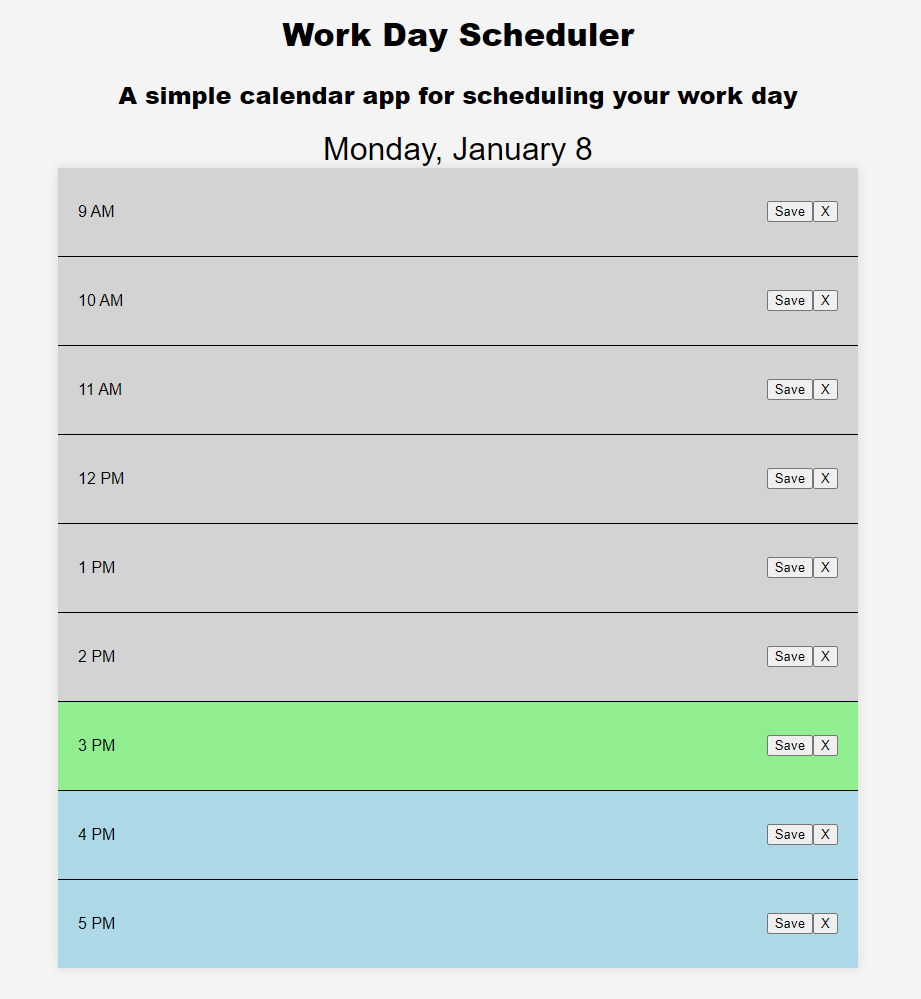

<!-- Repository contains quality readme file with description, screenshot, and link to deployed application.-->

# Work Day Scheduler

## Link to application
<!-- https://db-doo.github.io/coding-test/ -->

## Screenshot
<!--  -->

## Description

The Work Day Scheduler is a simple, browser-based calendar application that allows users to save events for each hour of a typical workday. Built with HTML, CSS, jQuery, and the Day.js library, this app is designed to help employees manage their daily schedules effectively.

### Features
- **Daily Schedule**: Plan your workday with hourly time blocks from 9 AM to 5 PM.
- **Persistent Storage**: Events are saved in the browser's local storage, ensuring that your schedule persists even after the browser is closed or reloaded.
- **Real-Time Updates**: The app highlights past, current, and future hours using different colors for easy identification.
<!-- TO DO -->
- **Responsive Design**: Compatible with various devices and screen sizes.
<!-- TO DO -->
